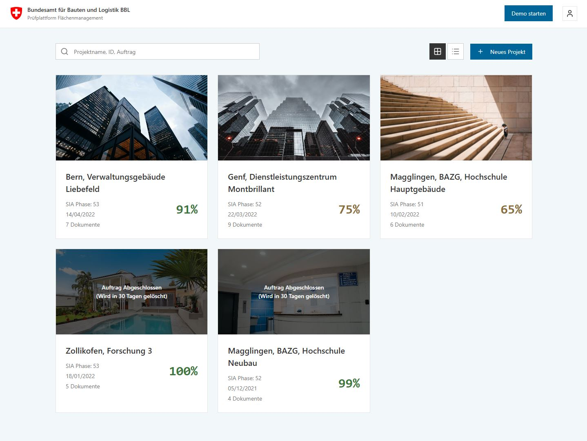
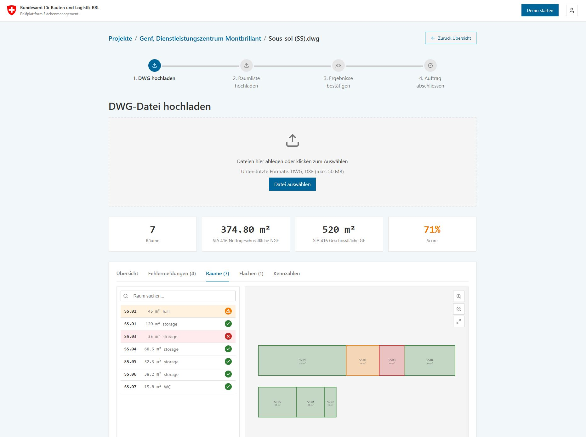

# plan-check

**BBL Plan Checker / Prüfplattform Flächenmanagement** - A prototype for validating floor plan drawings against Swiss Federal BBL CAD standards and SIA 416 area calculations.

## Live Demo

Visit the interactive prototype: **https://bbl-dres.github.io/plan-check/**

> Static HTML/CSS/JavaScript prototype showcasing the user interface and workflow. All data is mock — no backend processing.

<p align="center">
  
  
</p>

## Project Overview

A prototype exploring solutions for validating DWG/DXF floor plan files against BBL CAD-Richtlinie standards before CAFM import.

**Target Users:**
- BBL internal staff (Flächenmanagement team)
- External planners/architects submitting floor plans
- Project managers reviewing submissions

**Current Status:** Frontend prototype with mock data; backend not yet integrated

## Features

### Frontend Prototype
- **Swiss Federal Design System** - Official colors, typography, and layouts
- **Project Dashboard** - Grid/list view with searchable project cards and donut charts
- **Document Management** - Upload and track DWG/DXF/XLSX files with size validation
- **4-Step Validation Workflow** - Upload DWG → Upload Room List → Review Results → Submit
- **Floor Plan Viewer** - Speckle integration for plan visualization with error markers
- **SIA 416 Area Calculations** - Area breakdowns (GF, NGF, HNF, NNF, VF, FF)
- **Validation Results** - Error/warning list with severity levels (14 rules defined)
- **User Management** - Role-based access (Admin, Editor, Viewer)
- **Accessibility** - WCAG 2.1 AA compliant with keyboard navigation
- **Security** - XSS prevention, filename sanitization, Content Security Policy headers

### DWG Viewer (Root)
- Standalone LibreDWG WebAssembly viewer prototype
- Drag-and-drop DWG file upload with progress tracking

### Backend Prototype (Research)
- Python reference implementation (783 lines) in `prototype/documentation/research/`
- LibreDWG integration, validation rules, Excel parsing with openpyxl, geometry validation with Shapely

## Repository Structure

```
plan-check/
├── index.html              # DWG Viewer prototype (LibreDWG WebAssembly)
├── assets/                 # Static images, logos and test files
└── prototype/              # Main application
    ├── index.html          # Application entry point (GitHub Pages)
    ├── test.html           # Browser-based unit test runner (46 tests)
    ├── css/                # Stylesheets (Swiss Federal Design System)
    ├── js/                 # Application logic (~2400 lines) and tests
    ├── data/               # Mock JSON data (projects, documents, rules, users)
    ├── assets/             # Application assets
    └── documentation/      # Requirements, data model, styleguide, and research
```

## Technology Stack

### Frontend
| Technology | Purpose |
|------------|---------|
| HTML5 | Semantic markup |
| CSS3 | Custom properties, Grid, Flexbox |
| Vanilla JavaScript | No build tools required |
| Lucide Icons v0.562.0 | Icon library (CDN) |

### CSS Architecture
- **Design System:** Swiss Federal Corporate Design
- **Methodology:** BEM naming convention
- **Tokens:** 50+ CSS custom properties (colors, typography, spacing)
- **Grid:** 12-column responsive system
- **Breakpoints:** Mobile (576px), Tablet (768px), Desktop (992px), Large (1200px)

### Backend (Planned)
| Technology | Purpose |
|------------|---------|
| Python 3.12+ | Runtime |
| FastAPI | Web framework |
| LibreDWG | DWG processing |
| ezdxf | DXF fallback |
| Shapely | Geometry operations |
| openpyxl | Excel parsing |
| PostgreSQL + PostGIS | Database |
| Swiss eIAM | Authentication |

## Getting Started

### View the Demo
Visit: **[https://bbl-dres.github.io/plan-check/](https://bbl-dres.github.io/plan-check/)**

### Run Locally
```bash
# Clone the repository
git clone https://github.com/bbl-dres/plan-check.git
cd plan-check

# Start a local server (recommended)
python -m http.server 8000
# Visit http://localhost:8000/prototype/
```

### Run Tests
```bash
# Navigate to http://localhost:8000/prototype/test.html
```

The test suite includes 46 test cases covering:
- Security utilities (XSS prevention, path traversal)
- Parsing utilities (safe integer parsing)
- UI utilities (status icons, file size formatting)
- State management (AppState validation)
- Configuration validation
- Score status calculations
- Event listener management

## Configuration

Key configuration options in `prototype/js/script.js`:

```javascript
const CONFIG = {
    TOAST_DURATION_MS: 3000,
    STEP_COUNT: 4,
    MAX_IMAGE_SIZE: 10 * 1024 * 1024,  // 10 MB
    MAX_DWG_SIZE: 50 * 1024 * 1024,    // 50 MB
    MAX_EXCEL_SIZE: 10 * 1024 * 1024,  // 10 MB
    SCORE_SUCCESS_THRESHOLD: 90,
    SCORE_WARNING_THRESHOLD: 60,
    SEARCH_DEBOUNCE_MS: 300,
};
```

## Design System

The prototype follows the **Swiss Federal Corporate Design** guidelines:

| Element | Specification |
|---------|---------------|
| Primary Color | Venetian Red (#DC0018) |
| Secondary Color | Cerulean Blue (#006699) |
| Typography | Frutiger font family (with system fallbacks) |
| Spacing | 8px base unit system |
| Grid | 12-column responsive layout |
| Accessibility | WCAG 2.1 AA compliant |

See [prototype/documentation/styleguide.md](prototype/documentation/styleguide.md) for complete design specifications.

## Data Model

The application uses a normalized data structure with 6 entities:

```
User → Project → Document → Geometry (Rooms/Areas)
                         → ValidationResult
                         → RuleSet
```

| Entity | Description |
|--------|-------------|
| Project | Building projects with SIA phase (31-53) |
| Document | DWG/DXF/XLSX files with validation scores |
| Geometry | Room polygons and area calculations |
| RuleSet | 14 validation rules across 5 categories (Layer, Geometry, Entity, Text, AOID) |
| Result | Error/warning messages with locations |
| User | Accounts with roles (Admin/Editor/Viewer) |

See [prototype/documentation/data-model.md](prototype/documentation/data-model.md) for complete schema definitions.

## Demo Workflow

1. **Login** - Enter credentials (demo mode, any input works)
2. **Project Dashboard** - Browse projects with completion percentages and search (Ctrl+K)
3. **Project Detail** - View documents, users, and validation rules in tabbed layout
4. **Validation Workflow** - Step through the 4-stage process:
   - **Step 1:** Upload DWG file, view extracted rooms
   - **Step 2:** Upload Excel room list, compare with DWG
   - **Step 3:** Review SIA 416 area calculations and viewer
   - **Step 4:** Submit and complete validation
5. **Results** - See detailed error reports with severity indicators

## Documentation

| Document | Description |
|----------|-------------|
| [requirements.md](prototype/documentation/requirements.md) | Functional requirements (FR-1 to FR-10) |
| [styleguide.md](prototype/documentation/styleguide.md) | Swiss Federal Design System guide |
| [data-model.md](prototype/documentation/data-model.md) | Database schema and entity definitions |
| [typography-tokens.md](prototype/documentation/typography-tokens.md) | Typography CSS utilities |
| [plan-check-architecture.md](prototype/documentation/research/plan-check-architecture.md) | System architecture design |
| [plan-check-hosting.md](prototype/documentation/research/plan-check-hosting.md) | Hosting recommendations |
| [cloud-cad-api-comparison.md](prototype/documentation/research/cloud-cad-api-comparison.md) | Cloud CAD API analysis |

## References

- [Swiss Federal Design System](https://github.com/swiss/designsystem)
- [SIA 416 - Areas and Volumes of Buildings](https://www.sia.ch/de/dienstleistungen/sia-norm/sia-416/)
- [WCAG 2.1 Accessibility Guidelines](https://www.w3.org/TR/WCAG21/)
- [Lucide Icons](https://lucide.dev/)

## License

MIT License - See [LICENSE](LICENSE) for details.

---

**Built with:** HTML5, CSS3, Vanilla JavaScript
**Design System:** Swiss Federal Corporate Design
**Icons:** Lucide Icons (MIT)
**Last Updated:** February 2026
