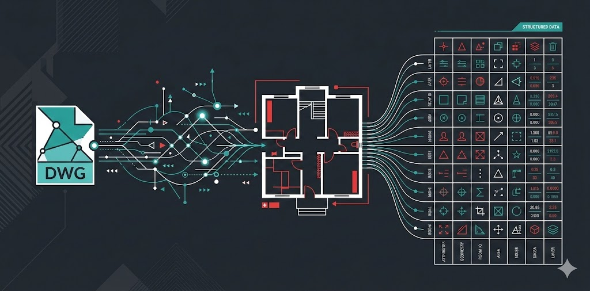
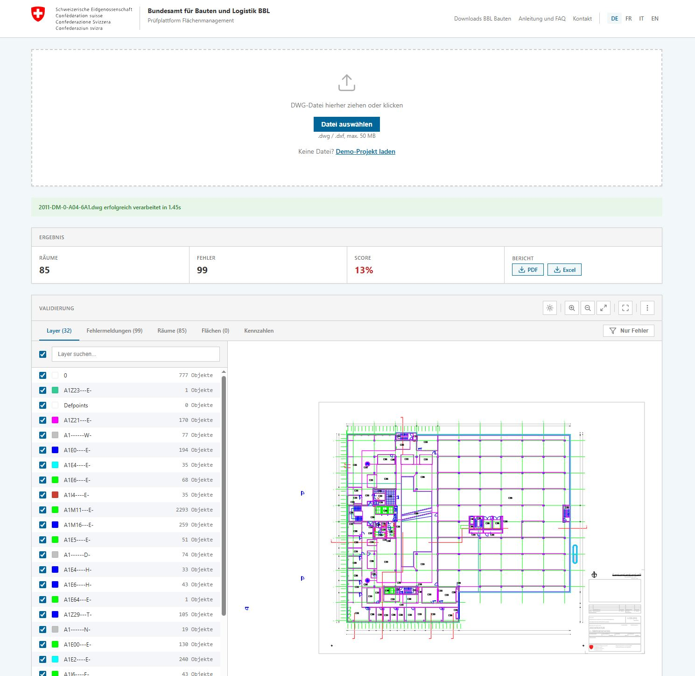
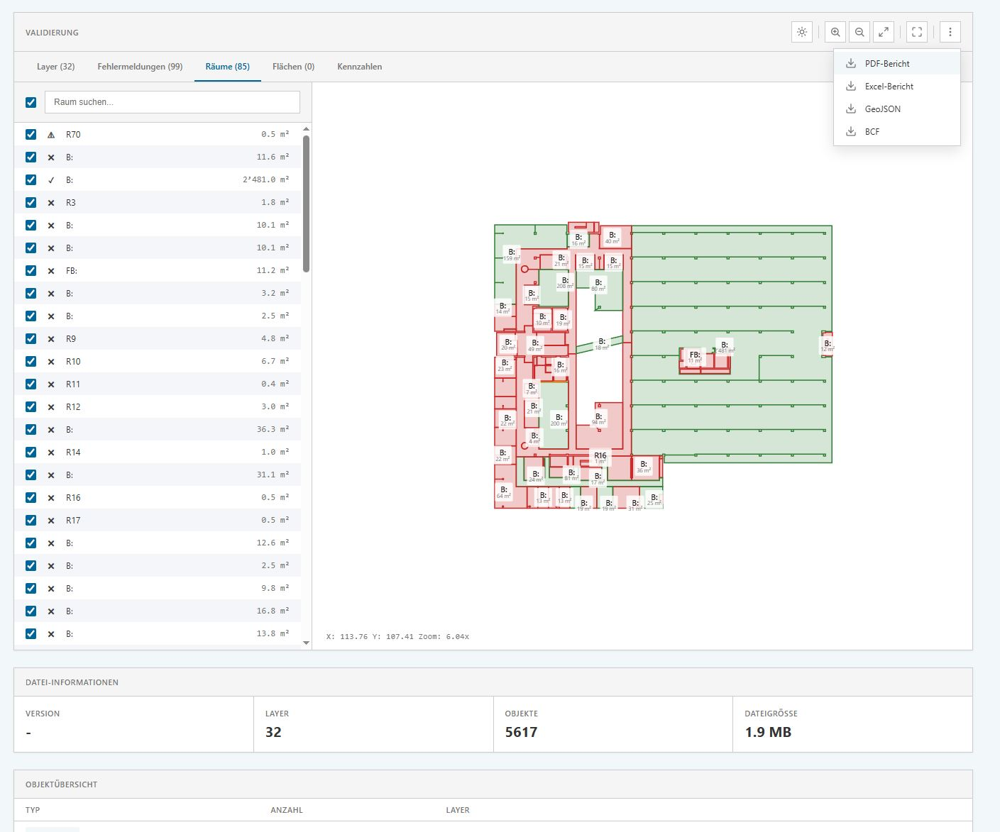

# Plan Checker / Prüfplattform Flächenmanagement



[](https://bbl-dres.github.io/plan-check/)
[](LICENSE)
[](https://developer.mozilla.org/en-US/docs/Web/JavaScript)
[](https://webassembly.org/)
[](https://developer.mozilla.org/en-US/docs/Web/API/Canvas_API)
[](#technology)

**BBL Plan-Check** — BBL Plan Checker / Prüfplattform Flächenmanagement - A prototype for validating floor plan drawings against Swiss Federal BBL CAD standards.

## Live Demo

**https://bbl-dres.github.io/plan-check/**

All processing runs locally in the browser via LibreDWG WebAssembly — no files are uploaded to a server.

<p align="center">
  
  
</p>

## Features

- **DWG/DXF Processing** — Upload and parse AutoCAD files (R13–R2024) directly in the browser using LibreDWG WebAssembly
- **Room Extraction** — Automatic detection of room polygons on the `A1Z21---E-` layer with text label matching
- **Area Extraction** — Recognition of area polygons on BGF/EBF/GF layers
- **Validation Rules** — Configurable rule engine checking labels, geometry closure, polygon integrity, and minimum area
- **Interactive Viewer** — Canvas 2D floor plan renderer with pan, zoom (mouse wheel + pinch), and click-to-select
- **Kennzahlen** — SIA 416 / DIN 277 area breakdowns (GF, NGF, KF, HNF, NNF, VF, FF) with donut chart visualization
- **PDF Report** — 6-page report with cover, layer overview, error list, room list, area list, and Kennzahlen
- **Excel Report** — XLSX workbook with 6 sheets matching the PDF structure
- **GeoJSON / BCF Export** — Export room geometries and BIM Collaboration Format issues (planned)
- **API Documentation** — Swagger-style docs rendered from an OpenAPI 3.0 spec (`?view=api-docs`)
- **Responsive Design** — Mobile-first layout with hamburger menu, touch gestures, and adaptive split view
- **Swiss Federal CD** — Official colors, typography, and layout following the Swiss Federal Corporate Design guidelines

## Getting Started

### View Online

Visit **[bbl-dres.github.io/plan-check](https://bbl-dres.github.io/plan-check/)** and either upload a DWG/DXF file or click **«Demo-Projekt laden»**.

### Run Locally

```bash
git clone https://github.com/bbl-dres/plan-check.git
cd plan-check
python -m http.server 8000
# Visit http://localhost:8000
```

No build step, no dependencies — just a static file server.

## Repository Structure

```
plan-check/
├── index.html                 # Application entry point
├── css/
│   ├── tokens.css             # Design tokens (colors, spacing, typography)
│   └── styles.css             # Component styles (~900 lines)
├── js/
│   ├── router.js              # URL-based view router (app vs. api-docs)
│   ├── app.js                 # File handling, pan/zoom, event wiring
│   ├── state.js               # Centralized application state
│   ├── dwg-processing.js      # LibreDWG WASM integration, entity parsing
│   ├── renderer.js            # Canvas 2D drawing, hit testing, popups
│   ├── validation.js          # Room extraction, rules engine, tab UI
│   ├── export.js              # PDF (jsPDF) and Excel (SheetJS) generation
│   ├── api-docs.js            # OpenAPI spec renderer
│   └── utils.js               # Shared helpers (formatting, geometry)
├── assets/
│   ├── openapi.json           # OpenAPI 3.0 specification
│   ├── test-files/            # Sample DWG files for demo
│   └── swiss-logo-*.svg       # Federal identity assets
├── docs/
│   └── anleitung-de.md        # User guide and FAQ (German)
└── prototype1/                # Earlier mockup prototype (archived)
```

## Technology

| Component | Technology |
|-----------|-----------|
| DWG Parsing | [libredwg-web](https://mlightcad.github.io/libredwg-web/docs/) (WebAssembly) |
| Rendering | [Canvas 2D API](https://developer.mozilla.org/en-US/docs/Web/API/Canvas_API) |
| PDF Export | [jsPDF](https://github.com/parallax/jsPDF) + [jspdf-autotable](https://github.com/simonbengtsson/jsPDF-AutoTable) |
| Excel Export | [SheetJS](https://sheetjs.com/) |
| Build Tools | None — vanilla HTML/CSS/JS |

## API (Planned)

A REST API for automated batch validation is documented at [`?view=api-docs`](https://bbl-dres.github.io/plan-check/?view=api-docs). The OpenAPI 3.0 spec is at [`assets/openapi.json`](assets/openapi.json).

Key endpoints: `/validate`, `/jobs/{jobId}/result`, `/jobs/{jobId}/export`, `/batch`.

## Documentation

- [Anleitung und FAQ (DE)](docs/anleitung-de.md) — User guide covering upload, validation, viewer, exports
- [API Documentation](https://bbl-dres.github.io/plan-check/?view=api-docs) — REST API reference

## References

- [Swiss Federal Design System](https://github.com/swiss/designsystem)
- [SIA 416 — Areas and Volumes of Buildings](https://www.sia.ch/de/dienstleistungen/sia-norm/sia-416/)
- [libredwg-web — LibreDWG WebAssembly](https://mlightcad.github.io/libredwg-web/docs/)
- [BBL — Bundesamt für Bauten und Logistik](https://www.bbl.admin.ch/)

## License

MIT License — See [LICENSE](LICENSE) for details.

---

**Bundesamt für Bauten und Logistik BBL** · Direktion Ressourcen
