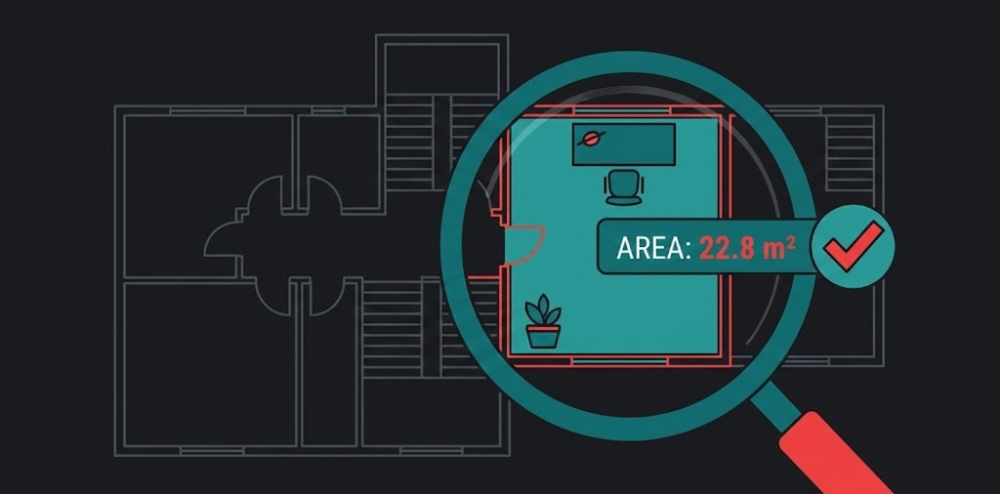

# Plan Checker / Prüfplattform Flächenmanagement

<p align="center">
  <a href="https://bbl-dres.github.io/plan-check/">
    
  </a>
</p>

[](https://bbl-dres.github.io/plan-check/)
[](LICENSE)

> [!CAUTION]
> Unofficial prototype for demonstration only. The sample data is fictional, validation is incomplete, and the tool is not a production approval service.

Browser-based prototype for checking DWG and DXF floor plans against selected BBL CAD and area-management rules.

## Demo

- **Plan viewer and checker:** https://bbl-dres.github.io/plan-check/
- **Project and access-management mockup:** https://bbl-dres.github.io/plan-check/prototype1/

Files are processed locally in the browser and are not uploaded to a server.

## Features

- Parse supported DWG and DXF files in the browser.
- Detect rooms and area polygons and apply configurable checks.
- Inspect plans with pan, zoom, selection, and issue highlighting.
- Review SIA 416 and DIN 277 area indicators.
- Export PDF and Excel validation reports.
- Open the prototype API reference from the same interface.

## Run locally

```bash
python -m http.server 8000
```

Open <http://localhost:8000/>.

## Documentation

- [User guide and FAQ (DE)](docs/anleitung-de.md)
- [Validation rules (DE)](docs/pruefregeln-de.md)
- [Terminology comparison](docs/terminologie-vergleich.md)
- [Prototype API reference](https://bbl-dres.github.io/plan-check/?view=api-docs)

## License

[MIT License](LICENSE). The bundled LibreDWG-based runtime retains its applicable license terms.
